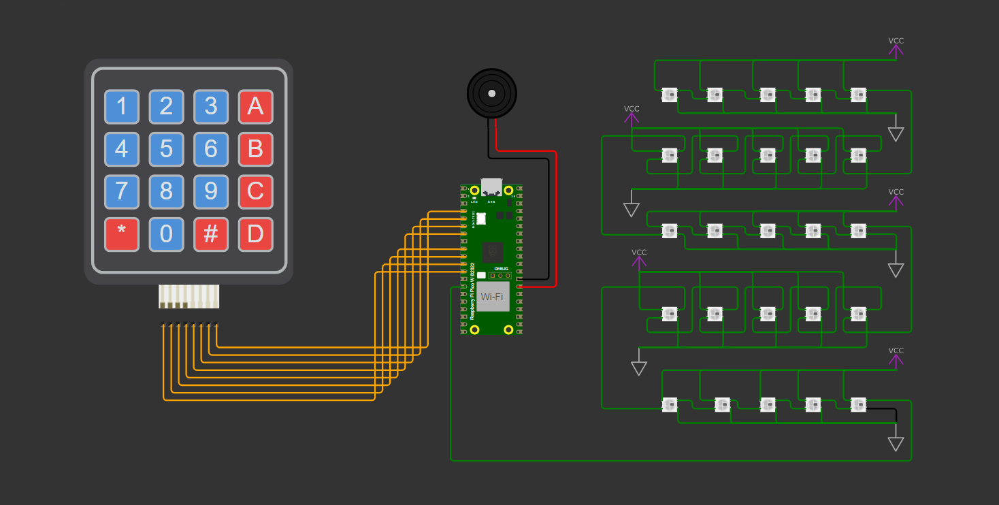
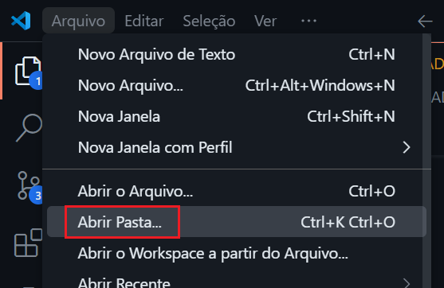
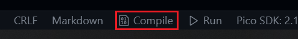
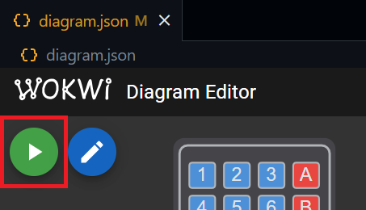

# Controlando uma matriz de LEDs RGB endereçáveis com o RP2040

## Sumário

1. [💡 O que é este projeto](#1--o-que-é-este-projeto)
2. [⚡ Diagrama do hardware](#2--diagrama-do-hardware)
3. [🎞️ Vídeo demonstrativo](#3--vídeo-demonstrativo)
4. [🔎 Funcionalidades disponíveis](#4--funcionalidades-disponíveis)
5. [🧰 Pré-requisitos para executar](#5--pré-requisitos-para-executar)
6. [💻 Como executar a simulação](#6--como-executar-a-simulação)
7. [👥 Colaboradores do projeto](#7--colaboradores-do-projeto)
8. [✨ Recursos para versionamento](#8--recursos-para-versionamento)

## 1. 💡 O que é este projeto

Este é um firmware escrito em C para controlar — por meio de um teclado matricial 4x4 — uma matriz de LEDs RGB endereçáveis conectada a um dos pinos GPIO de um Raspberry Pi Pico W. É possível controlar os LEDs individualmente para gerar animações com variação nas cores e na intensidade de cada um deles. O projeto também implementa a ativação de um buzzer e do modo BOOTSEL do microcontrolador.

## 2. ⚡ Diagrama do hardware

Os componentes são conectados de acordo com o esquema abaixo:

## 3. 🎞️ Vídeo demonstrativo

Uma demonstração do projeto em funcionamento pode ser assistida no link abaixo:

...

## 4. 🔎 Funcionalidades disponíveis

Por meio do teclado, o usuário pode realizar as seguintes ações:

- Pressionar `1` inicia a animação 1 (jogo da cobrinha);
- Pressionar `2` inicia a animação 2 (contagem de 1 a 9);
- Pressionar `3` inicia a animação 3;
- Pressionar `4` inicia a animação 4 (letras do nome "GUSTAVO");
- Pressionar `5` inicia a animação 5;
- Pressionar `6` inicia a animação 6 e liga o buzzer;

- Pressionar `A` desliga todos os LEDs da matriz;
- Pressionar `B` liga todos os LEDs na cor azul;
- Pressionar `C` liga todos os LEDs na cor vermelha;
- Pressionar `D` liga todos os LEDs na cor verde;

- Pressionar `#` liga todos os LEDs na cor branca;
- Pressionar `*` habilita o modo BOOTSEL na placa;

Observações:

- Pressionar outras teclas não tem efeito no circuito ou no firmware.

## 5. 🧰 Pré-requisitos para executar

A configuração sugerida para executar o projeto é:

1. Ter o [Pico SDK](https://github.com/raspberrypi/pico-sdk) instalado na sua máquina;
2. Ter o [ARM GNU Toolchain](https://developer.arm.com/Tools%20and%20Software/GNU%20Toolchain) instalado na sua máquina;
3. Ter o [Visual Studio Code](https://code.visualstudio.com/download) instalado na sua máquina;
4. Ter este repositório clonado na sua máquina;
5. Ter as seguintes extensões instaladas no seu VS Code:
- [C/C++](https://marketplace.visualstudio.com/items?itemName=ms-vscode.cpptools);
- [CMake](https://marketplace.visualstudio.com/items?itemName=twxs.cmake);
- [CMake Tools](https://marketplace.visualstudio.com/items?itemName=ms-vscode.cmake-tools);
- [Raspberry Pi Pico](https://marketplace.visualstudio.com/items?itemName=raspberry-pi.raspberry-pi-pico);
- [Wokwi Simulator](https://marketplace.visualstudio.com/items?itemName=Wokwi.wokwi-vscode).

## 6. 💻 Como executar a simulação

Com os pré-requisitos atendidos, siga os passos a seguir:

1. Utilize o VS Code para abrir a pasta raiz do projeto clonado:

2. Clique em "Compile", à direita da barra de status e aguarde o processo:

3. Abra o arquivo `diagram.json` e clique no botão de play para iniciar a simulação:

4. Quando a simulação iniciar, pressione os botões do teclado matricial para testar o firmware.

## 7. 👥 Colaboradores do projeto

Participantes do projeto por ordem alfabética e atividades desenvolvidas:

### Líder

#### Edeilton da Silva de Oliveira
- Responsável por...

### Desenvolvedores

#### Cibelle Sousa Rodrigues
- Responsável por...

#### Edemir de Carvalho Rodrigues
- Responsável por...

#### Gustavo Oliveira Alves
- Responsável por...

#### Joabis Oliveira dos Santos Júnior
- Responsável por...

#### Rogério Silva Palafoz Júnior
- Responsável por...

## 8. ✨ Recursos para versionamento

### Conventional Commits

Conventional Commits seguem uma estrutura fixa como feat, fix, docs e style, o que facilita identificar o escopo das mudanças. Isso ajuda a organizar o histórico e facilita o versionamento (por exemplo, ao definir o número da próxima versão do software).

### Labels no repositório

As labels em pull requests ajudam a identificar o escopo das tarefas. Nesse projeto, utilizamos:

- `bugfix`: para correção de bugs
- `documentação`: para indicar melhorias ou inclusões na documentação
- `readonly`: para indicar informação ou histórico
- `novidade`: para indicar a implementação de uma nova feature

### Branches nomeadas segundo o escopo

A nomeação de branches como `feature/...`, `docs/...` ou `bugfix/...` organiza o fluxo de trabalho e indica o propósito da branch, facilitando o entendimento. Portanto, foi um recurso adotado durante o desenvolvimento do projeto.

### Diretivas de pré-processamento

Neste projeto, utilizamos macros para definir os pinos associados à matriz de LEDs e ao buzzer. Os LEDs estão configurados no pino 10, enquanto o buzzer está conectado ao pino 21. Também definimos uma macro para o número de pixels na matriz de LEDs. Isso facilita identificar e alterar as configurações, caso necessário.